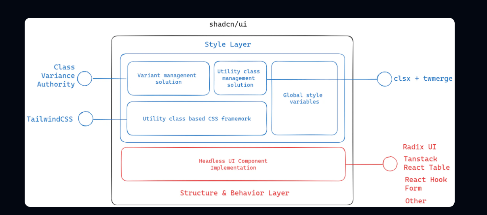
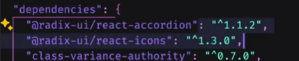

# Astro + Shadcn

- **Como funciona shadcn**

**Articulos de interes:**

- [anatomy-of-shadcn-ui](https://manupa.dev/blog/anatomy-of-shadcn-ui)
- [hoc-pattern](https://www.patterns.dev/react/hoc-pattern/)

Los componentes de shandcn/ui trabaja de la siguiente forma

**Class Variance Authority (CVA)**
Class variance authority nos permite hacer variantes y ya que nos permite heredar unas properties basado en un objeto.

**Class Utility management solution**
Tenemos clsx y twmerge ambas son utilizadas para poder sobrescribir los estilos de una class en base a condiciones.Nos permite como aplicar correctamente que clases

**Utility class based CSS framework**
Utilizando TailwindCSS para poder estilos en linea en nuestras etiquetas.

**Headless UI Component Implementation**
Se entiende que son componentes que básicamente no tienen estilos, no tienen una forma propia solo tienen la funcionalidad.En el caso de shadcn vienen de Radix UI.

Para la parte de tablas utiliza React Table Taanstack.
Para validar los formularios utiliza React Hook Form.
Otras.

**Por que usa Radix UI**
Basicamente cuando utilizamos shadcn utilizamos algunas dependencias que vienen de radix ui como los iconos o el componente estas tienen distintas versiones entre si por lo que asegura la compatibilidad entre si por que no tienen relaciones entre ellas.
No hay problemas de compatibilidad entre versiones.

**Por que utilizar un libreria Headless librarie**
Por ejemplo en el caso de shadcn nos provee ya de la funcion de screen readers para las personas con alguna discpacacidad y algunas funcionalidades ya probadas.

Las ventajas que nos ofrece es poder crear componentes muy customizables con variantes de estilos personalizada sin alterar la semántica y funcionalidad base y si depender de una version concreta de una libreria externa.

Algunas de las ventajas:

- Mejora la accesibilidad
- Los screen Readers
- Mejora la forma en que hacemos la interacciones con el teclado
